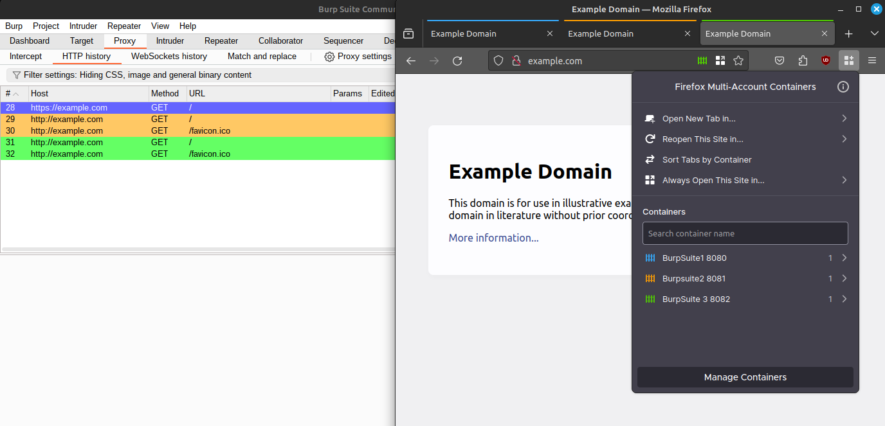
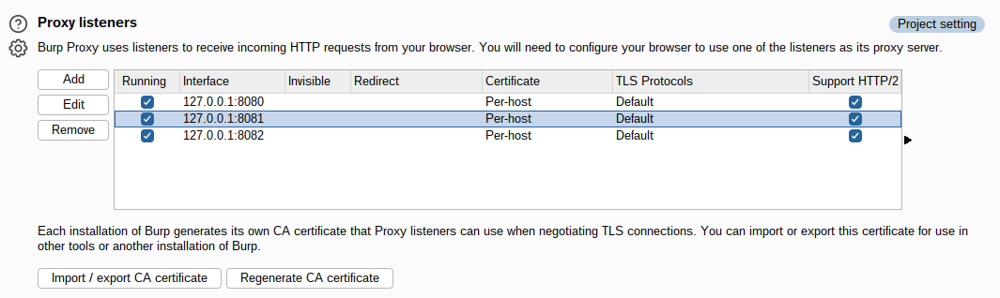
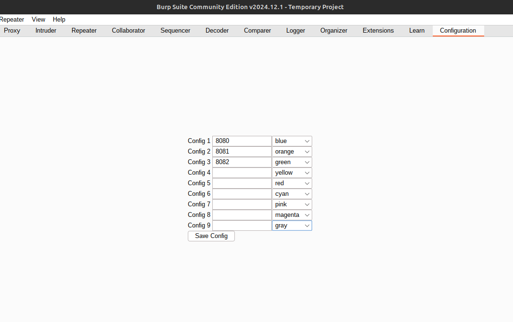

# Highligt-by-Port-BApp
A Jython BurpSuite Extension which highlights requests/responses in the Proxy tab based on the port the request/response was proxied through.

This app is designed to be used with browser tools like Firefox's official plugin "Firefox Multi-Account Containers". This plugin allows for containerizing tab groups and proxying each group through a unique proxy. 

This can allow users to have multiple different sessions and user accounts open in the same browser. Each group can be proxied through a different port set up in BurpSuite. With this plugin it becomes easy to tell which requests came from which container.

**This app requires Jython to run.** See the official documentation for details: [https://portswigger.net/burp/documentation/desktop/extensions/installing-extensions](https://portswigger.net/burp/documentation/desktop/extensions/installing-extensions)

